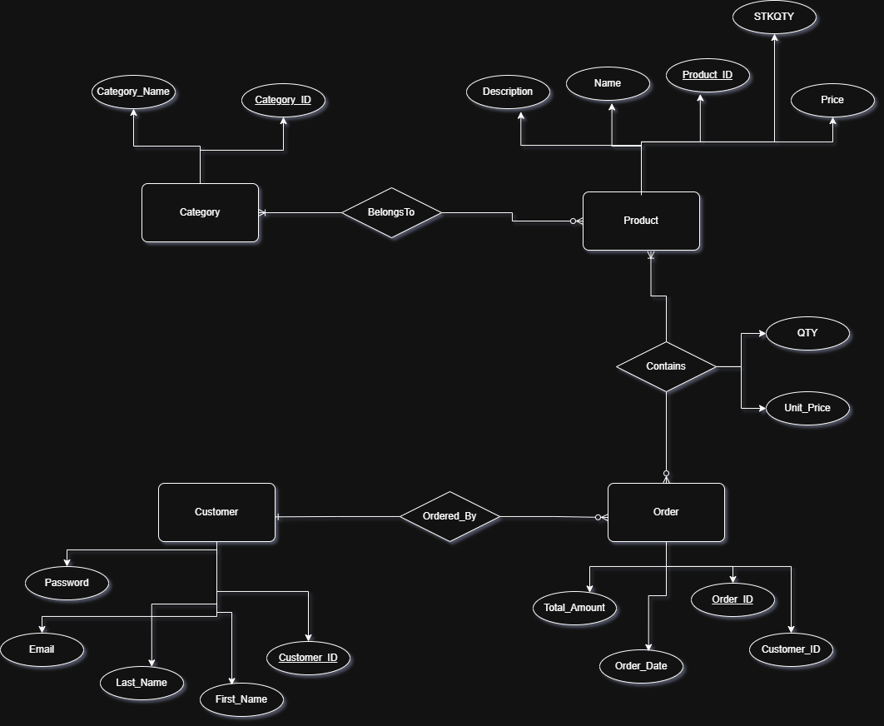
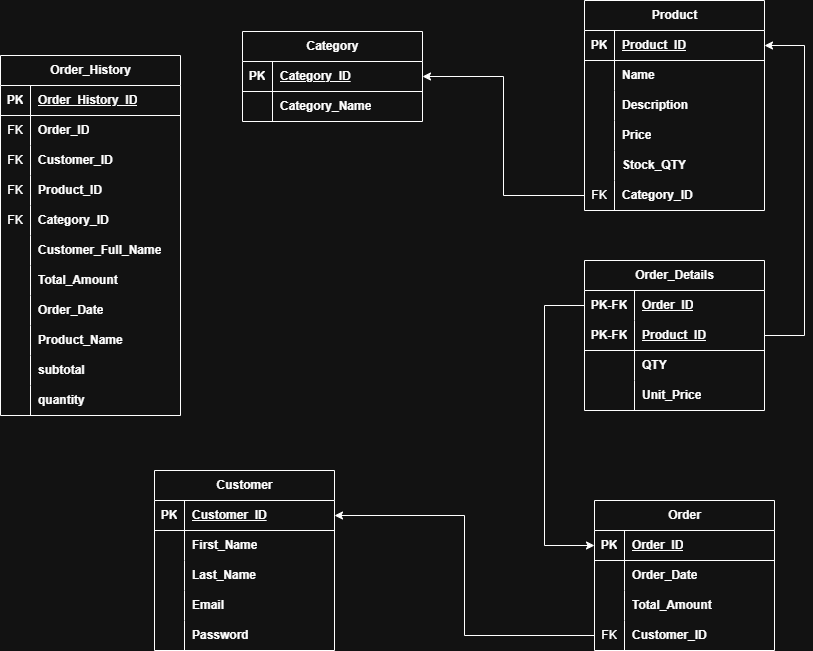

# **E-Commerce Database Design**

This repository includes the **database design** and **SQL implementation** for an **E-Commerce Web Application**, created as a practice exercise inspired by concepts from the book **Practical Web Database Design**.

> ⚠️ **Note:** This project is currently under development. The database schema and other components are subject to change.

---

## **Motivation**

This project is part of a mentorship program aimed at strengthening our **technical** and **interpersonal** skills to prepare for real-world market requirements.

---

## **Table of Contents**

- [Motivation](#motivation)
- [What's Included](#whats-included)
- [How to Browse](#how-to-browse)
- [ERD](#erd)
- [Relational Schema](#schema)
- [Schema DDL](#DDL)

---

## **What's Included**

- **Entity-Relationship Diagram (ERD)**.
- **Relational Schema**.
- **Normalization**
- **Denormalization**
- Notes and explanations on relationships and design choices.

---

## **How to Browse**

All diagrams and SQL code are included directly in this `README.md` file for easy navigation and reading.

---

<h2 align="center" id="erd">ERD</h2>

[](./ERD.png)

The ERD includes core components of an E-Commerce system, such as:

- **Customer**
- **Products**
- **Categories**
- **Orders**
- **Order Details**

---

<h2 align="center" id="schema">Relational Schema</h2>

[](./Relational-Schema.png)

This schema represents the core structure of a simplified E-Commerce system.  
While the design follows standard relational modeling practices, a small amount of **intentional denormalization** was applied to improve query performance and simplify reporting.

### Explanation:

- The **Order_History** table stores customer names and total amounts directly, even though this data also exists in other tables.  
  This avoids expensive joins when generating historical order summaries, this might slower the creating new order process but it could be fixed with a **background task** or **batch task** that runs once or twice a week to avoid this problem.
- Product pricing at the moment of purchase is copied into **Order_Details (Unit_Price)** to preserve price history, even if the product price changes later.
- Customer name fields are duplicated in **Order_History** to keep past records consistent even if the customer updates their profile.

These denormalizations are chosen on purpose for practical advantages in analytics, reporting, and historical accuracy, while keeping the overall schema clear and maintainable.

---

<h2 align="center" id="DDL">Schema DDL</h2>

<div style="max-height:300px; overflow-y=auto;">

```
CREATE TABLE IF NOT EXISTS Category(
Category_ID INT PRIMARY KEY,
Category_Name VARCHAR(20) NOT NULL
);

CREATE TABLE IF NOT EXISTS Product(
Product_ID INT PRIMARY KEY,
Name VARCHAR(30) NOT NULL,
Description VARCHAR(50) NOT NULL,
Price DECIMAL(7,2) NOT NULL CHECK(Price > 0),
Stock_QTY INT NOT NULL Check(Stock_QTY > 0)
);

CREATE TABLE IF NOT EXISTS  Product_Category (
Category_ID INT ,
Product_ID INT ,
PRIMARY KEY (Category_ID, Product_ID),
FOREIGN KEY (Category_ID) REFERENCES Category ,
FOREIGN KEY (Product_ID) REFERENCES Product
);

CREATE TABLE IF NOT EXISTS Customer(
Customer_ID INT PRIMARY KEY,
First_Name VARCHAR(20) NOT NULL,
Last_Name VARCHAR(20) NOT NULL,
Email VARCHAR(30) UNIQUE NOT NULL,
Password VARCHAR(255) NOT NULL
);

CREATE TABLE IF NOT EXISTS Orders(
Order_ID INT PRIMARY KEY,
Order_Date TIMESTAMP DEFAULT CURRENT_TIMESTAMP,
Total_Amount DECIMAL(9,2) NOT NULL CHECK(Total_Amount > 0),
Customer_ID INT NOT NULL,
FOREIGN KEY (Customer_ID) REFERENCES Customer(Customer_ID)
);

CREATE TABLE IF NOT EXISTS Order_Details(
Order_ID INT ,
Product_ID INT ,
QTY INT NOT NULL CHECK(QTY > 0),
Unit_Price DECIMAL(7,2) NOT NULL CHECK(Unit_Price > 0),
PRIMARY KEY (Order_ID, Product_ID),
FOREIGN KEY (Order_ID) REFERENCES Orders(Order_ID),
FOREIGN KEY (Product_ID) REFERENCES Product(Product_ID)
);

CREATE TABLE IF NOT EXISTS Order_History(
Order_ID INT PRIMARY KEY,
Customer_ID INT NOT NULL,
Customer_Full_Name VARCHAR(40) NOT NULL,
Total_Amount DECIMAL(9,2) NOT NULL CHECK(Total_Amount > 0),
Order_Date TIMESTAMP NOT NULL
)
```

</div>
